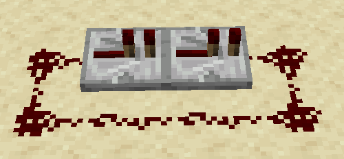
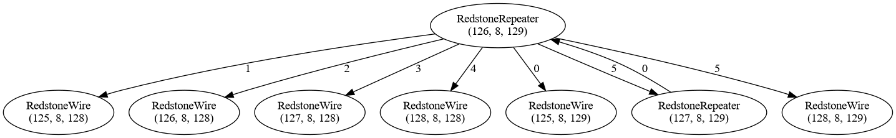

# Redpiler

The goal of this project is to optimize redstone to speeds which are largely considered impossible by using compiler techniques inspired by LLVM.

# In-memory representation

Redstone circuits can be represented as a weighted directed graph. The weights hold the signal strength distance of the connection. Links will not only have to hold the weight, but also the type of connection as some redstone components have different types of inputs. Finally, the nodes represent redstone components such as Repeaters, Comparaters, and Redstone Torches.

Redstone wires will not be nodes. The wires will instead be represented in the weights of the links.

# Stages

The compilation progresss will be split into stages as follows

1. Generation of the weighted directed graph
2. Logic Optimization
3. Generation of intermediate representation (e.g LLVM IR)
4. Native code generation

## Generation of the weighted directed graph

Firstly, a list of all redstone components in area will need to be created. This can be done easily by iterating through all blocks in the region and checking if they are potential components. Each component will be a node.

The links can be found by running a breadth first search starting from each input of the components. The weight will the be distance between the two componenets in signal strength.


### Example




## Logic optimization

TODO

## Generation of intermediate representation

TODO

## Native Code generation

Each node will generate 2 functions: update and tick. Each node will have a global memory location holding their state.
Example of generated code in C form:
```c
struct State {
    // Information such as powered or output strength
}

struct State n0;

void n0_update() {
    // ...
}

void n0_tick() {
    // ...
}
```